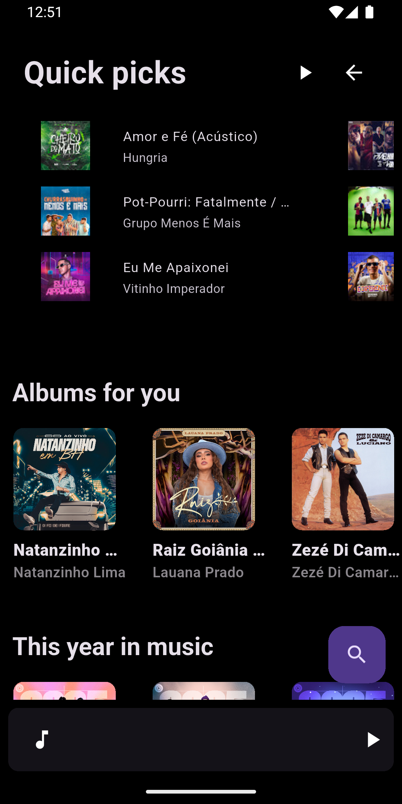
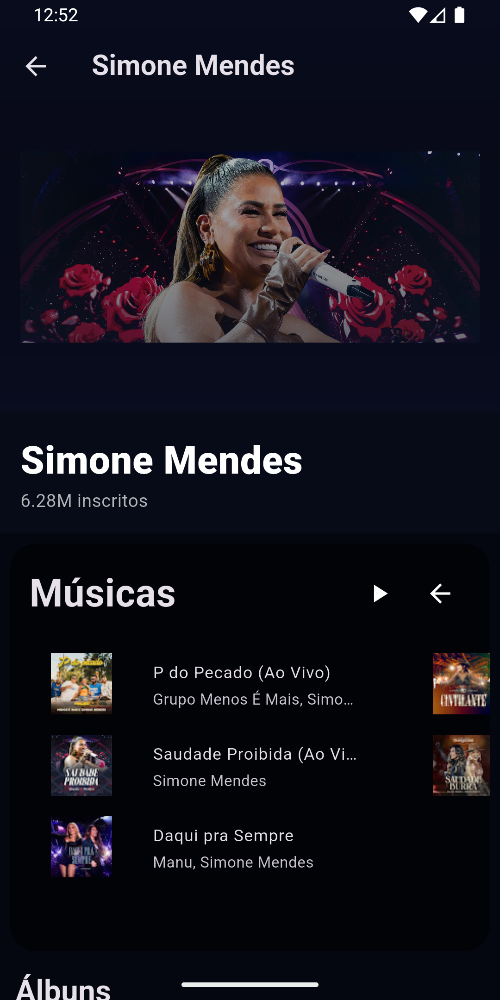

# 🎵 Dan Music

Dan Music é um aplicativo de música moderno e intuitivo, criado para oferecer a melhor experiência na descoberta, reprodução e organização das suas músicas favoritas diretamente do YouTube Music.
## 📥 Download

[](https://github.com/danilofcosta/Dan-Music/releases/latest)

## 🖼️ Screenshots

<p align="center">
  
  
  
</p>

## 🚀 Funcionalidades

- 🎧 Reprodução de músicas em alta qualidade  
- 🔍 Busca rápida por artistas, álbuns e músicas  
- 📱 Interface simples, bonita e responsiva  
- 🔄 Modo aleatório e repetição  
- ▶️ Streaming de áudio do YouTube  
- 📡 Extração de dados e faixas diretamente da plataforma  

## 🛠️ Tecnologias Utilizadas

- **Framework:** Flutter  
- **Linguagem:** Dart  

### 📦 Gerenciamento e Extração de Áudio
- `flutter_new_pipe_extractor`  
  Utilizado para extrair informações e streams de áudio:
  ```yaml
  flutter_new_pipe_extractor:
    git:
      url: https://github.com/danilofcosta/flutter_new_pipe_extractor.git
